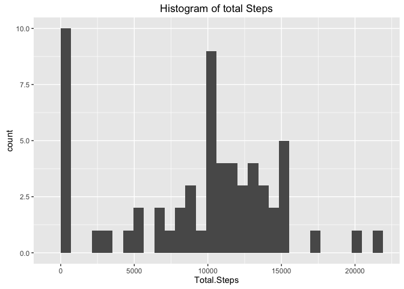
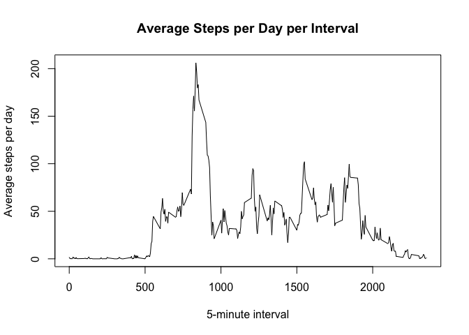
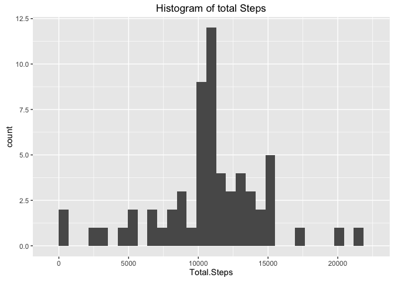
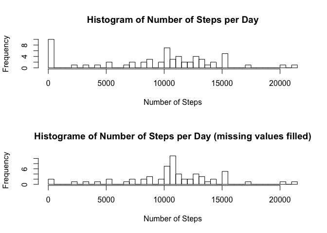
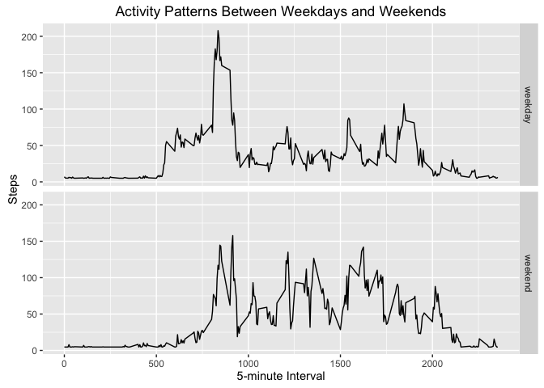

# Reproducible Research: Peer Assessment 1


## Loading and preprocessing the data

```
## 
## Attaching package: 'dplyr'
## 
## The following objects are masked from 'package:stats':
## 
##     filter, lag
## 
## The following objects are masked from 'package:base':
## 
##     intersect, setdiff, setequal, union
```
Load the csv dataset in [activity] variable,  date from character to date class

```r
activity<-read.csv("activity.csv",stringsAsFactors=FALSE)
activity$date<-as.Date(activity$date,"%Y-%m-%d")
```

## What is mean total number of steps taken per day?
####1. Make a histogram of the total number of steps taken each day

```r
#calculate steps per day
steps_per_day<-aggregate(activity$steps,list(activity$date),sum,na.rm=TRUE)
colnames(steps_per_day)<-c("Date","Total.Steps")
#Histogram of Total Steps
ggplot(steps_per_day,aes(Total.Steps))+geom_histogram(bins=30)+labs(title="Histogram of total Steps")
```

 
  
####2. Calculate and report the mean and median total number of steps taken per day

```r
#mean steps per day
mean_steps_per_day<-aggregate(activity$steps,list(activity$date),mean,na.rm=TRUE)
total_mean<-mean(activity$steps,na.rm=TRUE)
print(paste("Average of steps:",total_mean))
```

```
## [1] "Average of steps: 37.3825995807128"
```

```r
#median steps per day
median_steps_per_day<-aggregate(activity$steps,list(activity$date),median,na.rm=TRUE)
total_median<-median(sort(activity$steps),na.rm=TRUE)
print(paste("Median of steps:",total_median))
```

```
## [1] "Median of steps: 0"
```
## What is the average daily activity pattern?
####1. Make a time series plot (i.e. type = "l") of the 5-minute interval (x-axis) and the average number of steps taken, averaged across all days (y-axis)

```r
#average steps per interval
mean_steps_per_interval<-aggregate(activity$steps,list(activity$interval),mean,na.rm=TRUE)
plot(mean_steps_per_interval$Group.1,mean_steps_per_interval$x,type="l",xlab="5-minute interval",ylab="Average steps per day",main="Average Steps per Day per Interval")
```

 
  
####2. Which 5-minute interval, on average across all the days in the dataset, contains the maximum number of steps?

```r
#interval with max number of steps
print(paste("Interval with Maximum Number of Steps:",mean_steps_per_interval[mean_steps_per_interval$x==max(mean_steps_per_interval$x),1]))
```

```
## [1] "Interval with Maximum Number of Steps: 835"
```
## Imputing missing values
####1. Calculate and report the total number of missing values in the dataset (i.e. the total number of rows with NAs)

```r
##Total rows with NA steps
print(paste("Total rows with NA steps:",table(is.na(activity$steps))[2]))
```

```
## [1] "Total rows with NA steps: 2304"
```
####2. Devise a strategy for filling in all of the missing values in the dataset. The strategy does not need to be sophisticated. For example, you could use the mean/median for that day, or the mean for that 5-minute interval, etc.
Since the NA values corresponded only to whole days, the strategy used is to add the mean of the data set to the missing values.  

####3. Create a new dataset that is equal to the original dataset but with the missing data filled in.

```r
new_activity<-activity
new_activity[is.na(new_activity$steps),1]<-mean(new_activity$steps,na.rm=TRUE)
```
####4. Make a histogram of the total number of steps taken each day and Calculate and report the mean and median total number of steps taken per day. 

```r
#NEW CALCULATIONS BASED ON MISSING DATA FILLED DATASET
#calculate steps per day
new_steps_per_day<-aggregate(new_activity$steps,list(new_activity$date),sum,na.rm=TRUE)
colnames(new_steps_per_day)<-c("Date","Total.Steps")
#Histogram of Total Steps
ggplot(new_steps_per_day,aes(Total.Steps))+geom_histogram(bins=30)+labs(title="Histogram of total Steps")
```

 

```r
#mean steps per day
new_mean_steps_per_day<-aggregate(new_activity$steps,list(new_activity$date),mean,na.rm=TRUE)
new_total_mean<-mean(new_activity$steps,na.rm=TRUE)
print(paste("Average of steps (missing values filled):",new_total_mean))
```

```
## [1] "Average of steps (missing values filled): 37.3825995807128"
```

```r
#median steps per day
new_median_steps_per_day<-aggregate(new_activity$steps,list(new_activity$date),median,na.rm=TRUE)
new_total_median<-median(sort(new_activity$steps),na.rm=TRUE)
print(paste("Median of steps (missing values filled):",new_total_median))
```

```
## [1] "Median of steps (missing values filled): 0"
```
####4 cont. Do these values differ from the estimates from the first part of the assignment? What is the impact of imputing missing data on the estimates of the total daily number of steps?

```r
##comparison
print(paste("Average of steps:",total_mean))
```

```
## [1] "Average of steps: 37.3825995807128"
```

```r
print(paste("Average of steps (missing values filled):",new_total_mean))
```

```
## [1] "Average of steps (missing values filled): 37.3825995807128"
```

```r
print(paste("Median of steps:",total_median))
```

```
## [1] "Median of steps: 0"
```

```r
print(paste("Median of steps (missing values filled):",new_total_median))
```

```
## [1] "Median of steps (missing values filled): 0"
```

```r
##histo comparison
par(mfrow=c(2,1))
hist(steps_per_day$Total.Steps,breaks=60, main="Histogram of Number of Steps per Day",xlab="Number of Steps")
hist(new_steps_per_day$Total.Steps,breaks=60,main="Histograme of Number of Steps per Day (missing values filled)",xlab="Number of Steps")
```

 
  
The mean and median values don't differ, but the histogram does (more noticeable in the 10000 steps mark), so it implies that the distribution changed but keeping these statistical measurements equal.    

## Are there differences in activity patterns between weekdays and weekends?
####Create a new factor variable in the dataset with two levels – “weekday” and “weekend” indicating whether a given date is a weekday or weekend day.

```r
activity2<-new_activity
activity2$weekend<-weekdays(activity$date)=="Sunday" | weekdays(activity$date)=="Saturday"
activity2$weekend<-as.factor(activity2$weekend)
levels(activity2$weekend)<-c("weekday","weekend")
```
####Make a panel plot containing a time series plot (i.e. type = "l") of the 5-minute interval (x-axis) and the average number of steps taken, averaged across all weekday days or weekend days (y-axis).

```r
a2<-aggregate(activity2$steps,list(activity2$weekend,activity2$interval),mean,na.rm=TRUE)
ggplot(a2,aes(Group.2,x))+geom_line()+facet_grid(Group.1~.)+labs(title="Activity Patterns Between Weekdays and Weekends")+xlab("5-minute Interval")+ylab("Steps")
```

 
